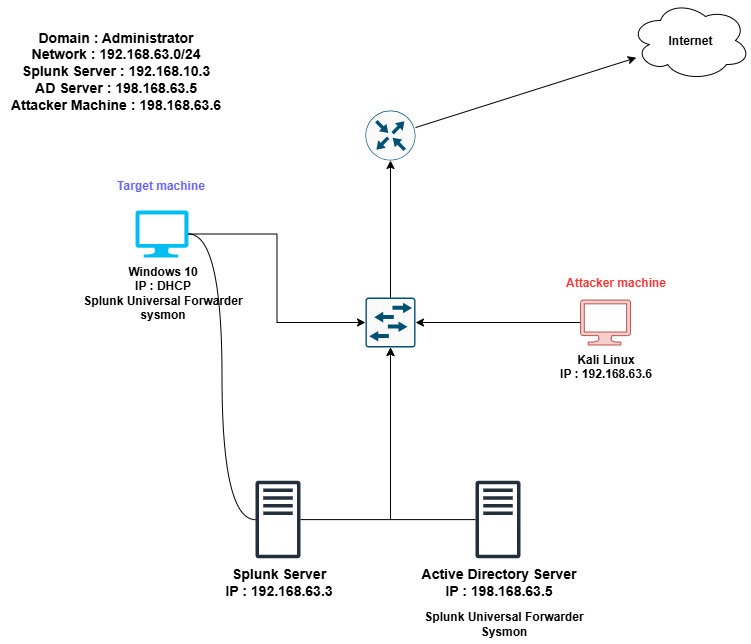
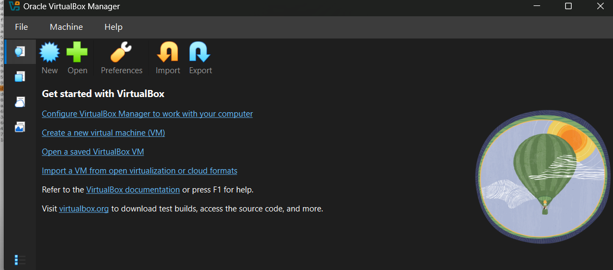
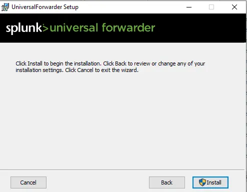
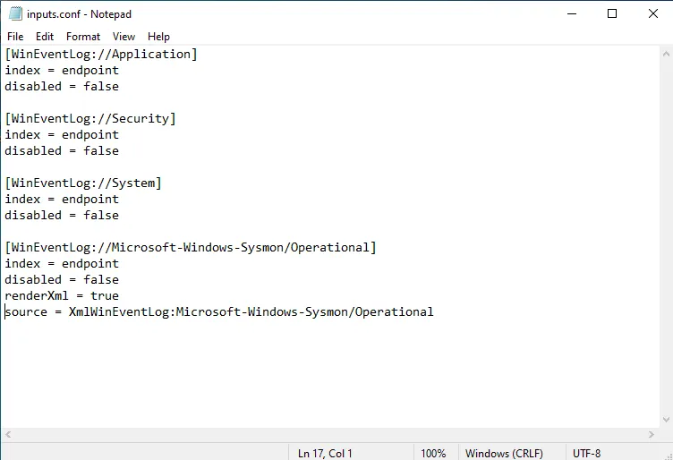
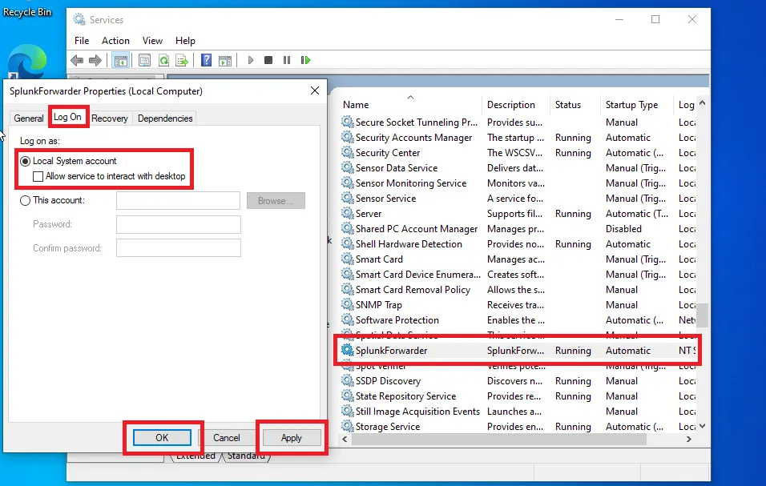
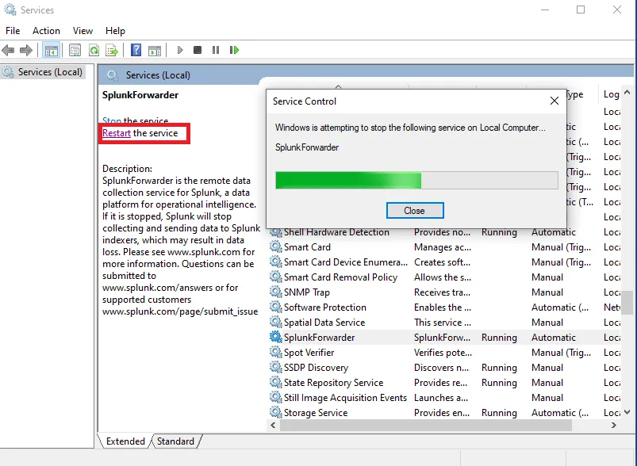
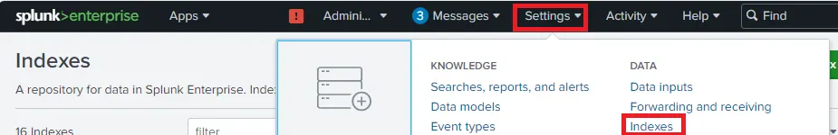
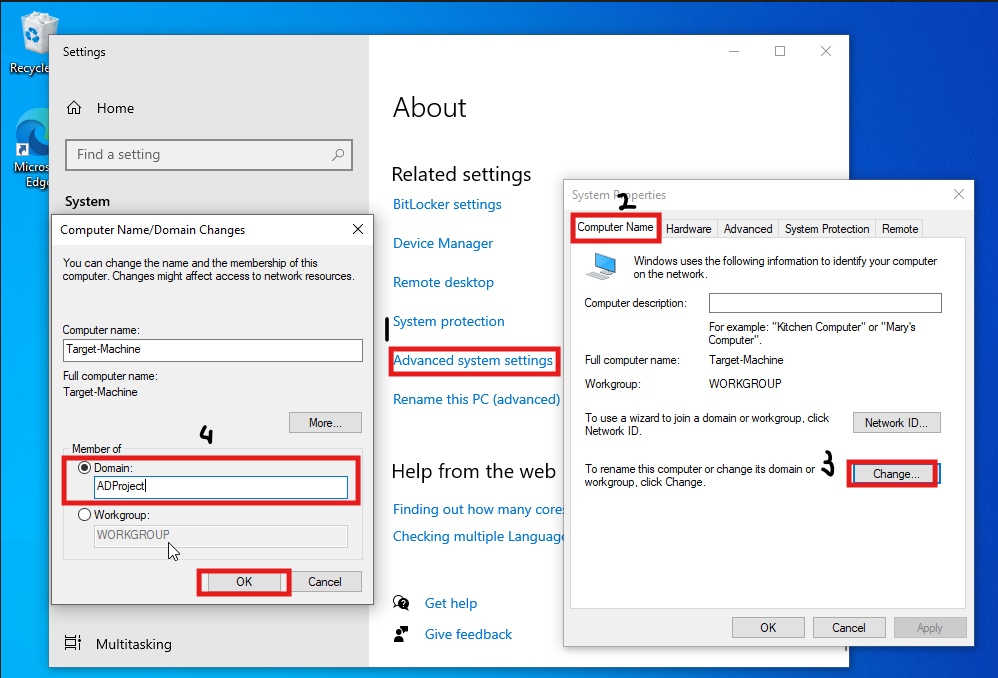
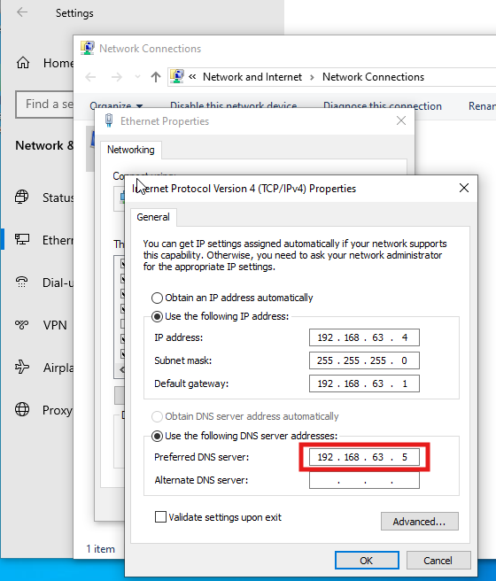

# Active Directory Implementation and Security Monitoring using Splunk

# Introduction :

This documentation will walk you through the process of building a home lab using **Active Directory (AD)** and **Splunk Security Information and Event Management (SIEM).** After end of this, you will have a functional lab environment where you can practice AD attacks, threat detection, incident response.

# Overview :

This project focuses on setting up an **Active Directory (AD) environment** from scratch using Windows Server. It includes configuring a Domain Controller, managing users, groups, and organizational units, and applying security policies through Group Policy Objects (GPOs). Client machines will be joined to the domain to demonstrate centralized authentication and management.

To strengthen security, the project integrates **Splunk** for monitoring AD logs, detecting suspicious activities, and generating alert.

# Requirements :

1. Virtual box (VMs).
2. Windows sever (AD).
3. Kali linux (Attacker machine).
4. Windows 10 (Splunk Universal Forwarder with sysmon).

# 1.Install Virtual Box :

- Download VirtualBox from https://www.virtualbox.org/wiki/Downloads : → Run the installer **.exe →** Go with the default setting or you may change as per your requirement → install dependencies → finish.

# 2. Install & configure Windows 10 (Target machine):

- Now Download the windows 10 tool from [here](https://www.microsoft.com/en-ca/software-download/windows10) → open media creation .exe file → accept the agreement → create installation media → language edition : default → save as ISO file where you like.
- After successfully installing the IOS file Go to Virtual Box → New (top left corner) : New virtual machine → Add name →VM folder : Default → ISO image :select path where you downloaded above file for windows 10 → **Uncheck Proceed with Unattended installation** → next → Specify virtual hardware : Base Memory : at least 4GB , Disk size : default →Finish the installation and start the vm.

- Windows setup :
    
    Activate Windows → I don’t have a product key → Select Windows 10 Pro OS → Custom → Next.
    
    
    

# **3. Install & setup Kali linux for Attacking :**

- Download [kali linux](https://www.kali.org/get-kali/#kali-virtual-machines) virtual machine for VirtualBox.→ Unzip the 7zip file → Download the 7-zip app from [here](https://7-zip.org/) according to you pc config like x64 or x34.
    
    
    
- Open the unzip folder → double click on the **.vbox** file ( if file extension not shown click→ view (top)→show more →check the file name extension).
- Kali linux automatically open in virtual box.
- Default credentials (Username : **kali** password : **kali).**

# **4. Install & setup Windows server for Active Directory :**

- Download [windows server 2022](https://www.microsoft.com/en-in/evalcenter/download-windows-server-2022) ISO 64-bit.
- Go to VirtualBox add new machine → give machine name and file location in **ISO Image** and make sure the proceed with Unattended installation is uncheck.

- Server Setup :
    - after opening the server the setup screen appear click Next → Install now → Select Windows server 2022 standard evalution (desktop experience) →accept agreement → Custom install → next.
        
        
        

# **5. Install & setup Ubuntu server for Splunk SIEM :**

- Download the [Ubuntu server 22.04](https://releases.ubuntu.com/jammy/).
- Open VirtualBox  → add new machine →  give machine name **Splunk** and file location in **ISO Image** and make sure the proceed with Unattended installation is uncheck.→ Choose the hardware and disk size according to your hardware aspects.
- start the Splunk machine and leave all settings default → complete your profile with username and Password → keep all setting default → continue → Reboot →after rebooting you see errors hit Enter → after completions of all updates login with the created username or password → Type this command to update & upgrade the splunk server directories.
    - `sudo apt-get update && sudo apt-get upgrade -y`

# 6. Install & Configure Sysmon and Splunk on Windows and AD server :

- First we set the our VMs networking setting to Nat Network :
    - Go to VirtualBox → Networks → Create → Give the name and ip and enable DHCP → apply.
        
        
        
- Go to Splunk server → Settings → Network → Attach to : NAT Network → name → select the name you created in previous.
    
    
    
- Do above step also for **Active directory Server**, **Windows Machine**, **Kali linux** as well.
- Set the Static IP in Splunk server :
    - Type this command in splunk `sudo nano /etc/netplan/00-installer-config.yaml`  or `sudo nano  /etc/netplan/50-cloud-init.yaml`
    - make the changes shown in screenshot : save by pressing Ctrl + X → y
        
        
        
    - now type `sudo netplan apply`  → you will warnings ignore them.
        
        you can see your DHCP setting is modify by typing command `ip -a`  and check the google connectivity by `ping google.com` .
        
        
        
    
    ## A.  Install Splunk in Ubuntu :
    
    - Now we will install splunk in ubuntu for that go to this [site](https://www.splunk.com/en_us/sign-up.html?redirecturl=https%3A%2F%2Fwww.splunk.com%2F) & signup if not, then log-in & go to Products -> Free trials -> Splunk enterprise : get free trial -> Linux -> .deb ->download and save in any folder.
    - Go to Splunk vm and install guest add-ons for virtual box by typing command `sudo apt-get install virtualbox-guest-additions-iso` .
    - Now on the top click on devices → shared folder → shared folder settings → add folder → folder path : select path of the folder where you save splunk .dev installer → give name → check all the option available except one.
        
        
        
    - Now reboot the splunk machine by `sudo reboot`  and  add our user to vbox SF group `sudo adduser <username> vboxsf` : you can see the error showing vboxsf does not exits.
        - now we will install virtual box guest utils : `sudo apt-get install virtualbox-guest-utils` → `sudo reboot`  → after rebooting login with username and password then add the vbox Sf user by typing above command of adduser.
            
            
            
        - create share directory `mkdir share`  and mount the share folder onto share directory by typing command `sudo mount -t vboxsf -o uid=1000,gid=1000 <type share folder name> share/`  : you can see your share folder name → devices → shared folder → shared folder settings → double click your create folder and see the name.
    - Now Install the splunk first type `cd /share` and then `dpkg -i <name of this splunk installer >`  you can also hit tab after writing splunk to complete the name automatic. After completing go to splunk directory by `cd /opt/splunk`
        - Changing to user splunk by typing `sudo -u splunk bash`  → change the directory `cd /opt/splunk/bin` .
        - Start the splunk server by typing `./splunk start`  accept the license and agreement and create administration username and password.
        - In /opt/splunk/bin directory type command `sudo ./splunk enable boot-start -user splunk`  this will make sure when virtual machine reboot splunk start with user.
    
    ## B. Install Splunk universal forwarder and sysmon on both Target machine and AD Server :
    
    You can install or configure the **Sysmon** and **Splunk Universal forwarder** on **Target machine** as well as **AD Server.**
    
    - Start the Windows machine → rename the pc name to target-machine → configure the network setting : go to **Network and internet settings** →change adapter options → Ethernet → properties → IPV4 → Properties → enter ip and default gateway as per the our diagrams structure.
    - Now we will install splunk universal forwarder to forward logs to the splunk server from windows machine.
    - Go to windows pc -> browser -> splunk.com -> log in -> products -> free trials -> universal forwarder : get free -> Windows -> 64-bit .msl : download now -> open the installer in downloads folder -> accept license and select on premise -> username : admin & select random password -> default -> Receiving indexer : splunk server ip address & port 9997 -> install.
        
        
        
    
    ## **Now Install the Sysmon on target machine :**
    
    - Download [sysmon](https://download.sysinternals.com/files/Sysmon.zip) from [sysinternal page](https://learn.microsoft.com/en-us/sysinternals/downloads/sysmon).
    - We will download olaf config for sysmon, save the doc as [config.xml](https://github.com/olafhartong/sysmon-modular/blob/master/sysmonconfig.xml) file
        
        
        
    - Now extract the sysmon zip, open admin powershell & go to the same folder where sysmon is extracted. Also copy the config to sysmon folder.
    - Now start sysmon with olaf config **`*./sysmon64.exe -i ..\sysmonconfig.xml*`** & hit enter -> accept agreement -> sysmon will be installed & started.
        
        
        
    - Open notepad as Admin & fill in as below for sysmon & save it under **C:\Program files\SplunkUniversalForwarder\etc\system\local as inputs.conf.** This will allow splunk forwarder to take sysmon logs as well as system, security & application winevent logs.
    
    
    
    - make sure the file save proper in above location and under save as type select All Files otherwise the events not shown in the splunk web.
        
        
        
    - Now we will restart splunk forwarder service & change service account of splunk to local system by going to services as admin. search **splunk forwarder →** double click to open → log on → change log on as : local system account → apply & ok → restart the splunk forwarder.

- The given below step you can apply on only one machine either AD Server or Target Machine.
- Now login to splunk web portal using splunk server IP & port number as **192.168.63.3:8000 →** settings → indexes → new index → index name : endpoint (we configured inputs.conf in which we have index endpoint) → save

- Now go to settings → forwarding & receiving → configure receiving → new receiving port → 9997 → save this will be our log receiving port
    
    
    

- If we have done everything correctly we will start seeing logs from our **Target machine** as well as our **AD Server**. Go to Apps (upper left corner) -> search & reporting -> In search : index= “endpoint” -> you will see events for Target machin and AD Server.
    
    
    

# 7. Configure Active Directory on Server & Joining Target machine to Domain.

- Open AD Server → go to network & internet settings → change adapter option → right click interface → properties → double click ipv4 → use the following ip address → enter the ip and gateway and DNS → ok.
- Open server manager → manage (top right corner) → add roles & features → Next → role-based → Next → Active Directory Domain Services → Add features → Next → Next → Next → Install → Configuration required → Close
- Go to server manager → flag → Promote -> Add new forest → (any_name).local → give secure password → all default(Next) → Install
    
    
    
- Now we create some users in our Active Directory to do go to server manager → Tools(top right corner) → AD Users & Computers → right click on domain → OU → named as IT → in IT unit right click → New → User → give name and password.
    - With the above step you can create multiple Organizational Unit (IT, HR, SALES, ACCOUNT etc) and create User in every organizational unit. Here i created  some OU and Users
    
    
    
    
    
- We Created the OU and Users, Let’s add out Target Machine(WIndows) to the Domain using above created accounts. Go to Windows PC → log in → Search this PC → Properties → Advaced system settings (in bottom) → computer name → Change → Domain → Type the domain name (in my case ADProject.local) → OK → use Administration account to login →OK
    
    
    
    - If you face error “domain could not be contacted “ change the Windows machine DNS  IP to Doamin control IP.
        
        
        
- After restarting the machine you can log in with Any user you created in AD Server.
    
    
    

# 8. Configure ART to generate telemetry & observer in Splunk Using Attacker machine (Kali).

- First we change the ip config of our attacker machine to do so login into kali → right click on ethernet Icon (top right) → edit connections → wired conn. → select setting icon (bottom left) → ipv4 settings → Method : manual → add → give ip, netmask (24), gateway, Dns server → save
    
    
    
- Now update & upgrade the directory by typing this command in terminal → `sudo apt-get update && sudo apt-get upgrade -y` .
- After the finishing we creating a new directory called ad-project first we go to Desktop where we save the deirectory `cd Desktop` and then `mkdir ad-project` .
- Now we install Crowbar tool for performing Brute Force Attack to install crawbar type command `sudo apt-get install -y crowbar`
- Now ******we will create a wordlist for this attack by going to wordlists folder by doing `cd /usr/share/wordlists` **→** now ****unzip the worlist file by `sudo gunzip rockyou.txt.gz`  → now we will get this file to our created directory for accessibility by `cp rockyou.txt ~/Desktop/*ad-*project **`->** change to the desktop folder by `cd ~/Desktop/ad-project` ***.***
    
    
    
- Now to make our own wordlist we will use `head -n 20 rockyou.txt > password.txt` ******then in this file we will add our **test user’s password** as we will have to see in telemetry how does successful log-in looks using `nano password.txt` now we will put the password of users that we created & save it using CTRL + X & press Y & hit enter.
    
    
    
- We are performing brute force attack by crowbar but first we need to enable the RDP (remote desktop protocol) for that go to out Target Machine (Windows) → log in → Search bar → PC → properties → advanced system settings → enter admin credentials → remote → allow remote connections → select users → Add that user which we created in the AD server and whose password is the one we put in password.txt. → check name → ok → ok → apply → ok.

- Now to do attack open Attacker machine Terminal → type `crowbar -b rdp -u balice (username) -C password.txt -s 192.168.63.4/32` .
- if you face error like this ignore username here:
    
    
    
    - type this  because we are using version 3 but crowbar looking for binary at the traditional xfreerdp path, So we create the symbolic link → `sudo ln -s /usr/bin/free /usr/bin/xfreerdp`.
